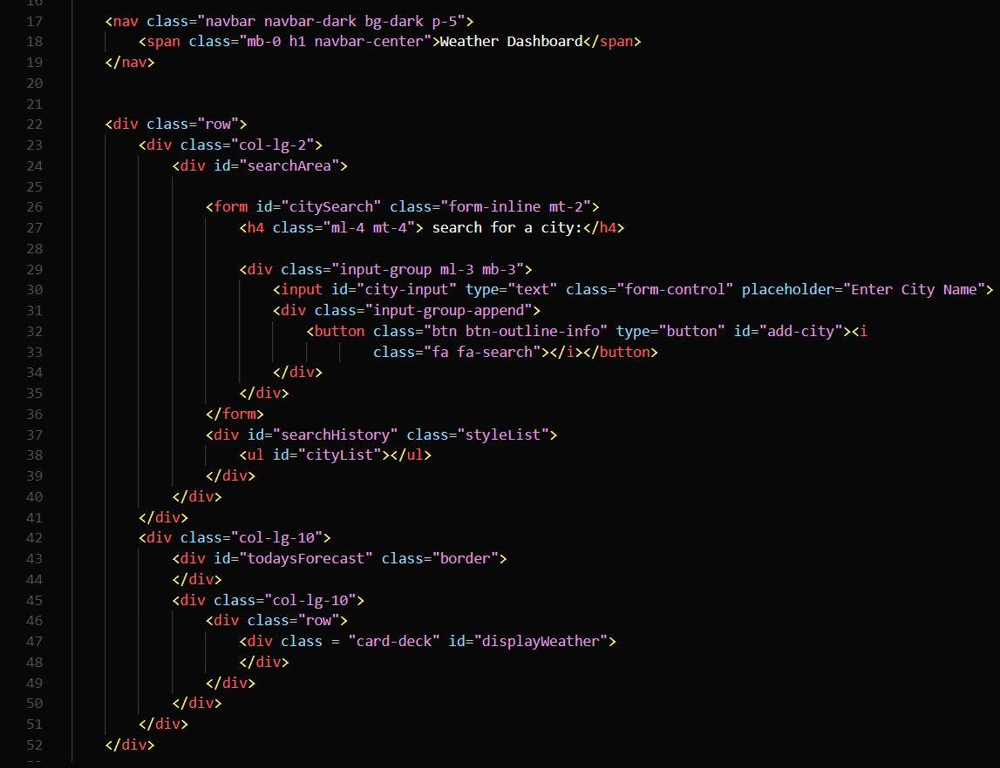
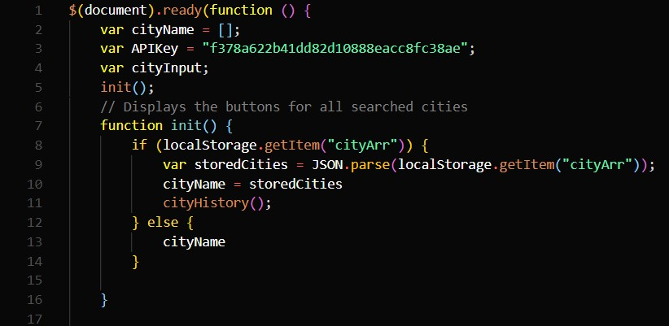
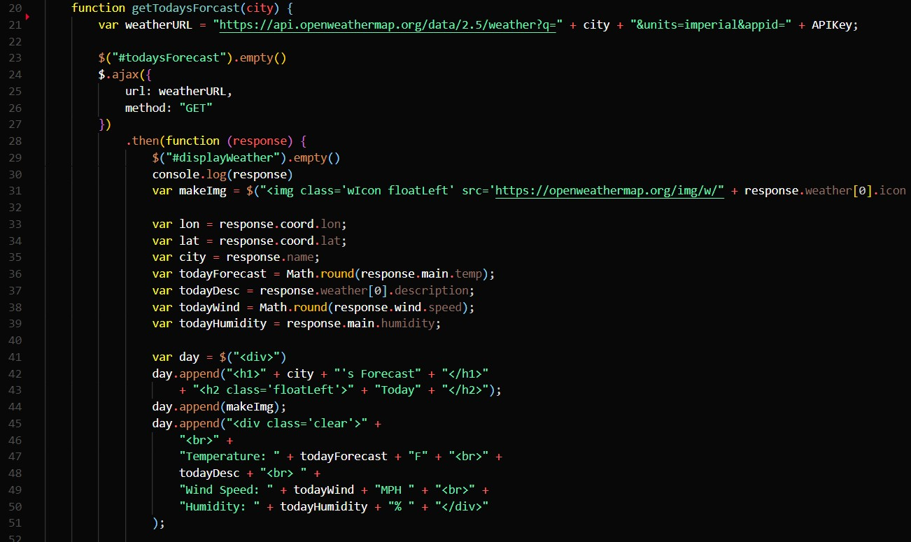
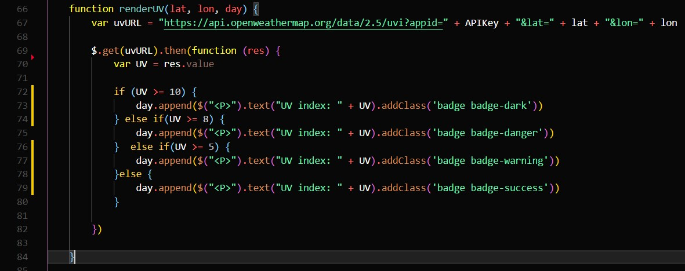
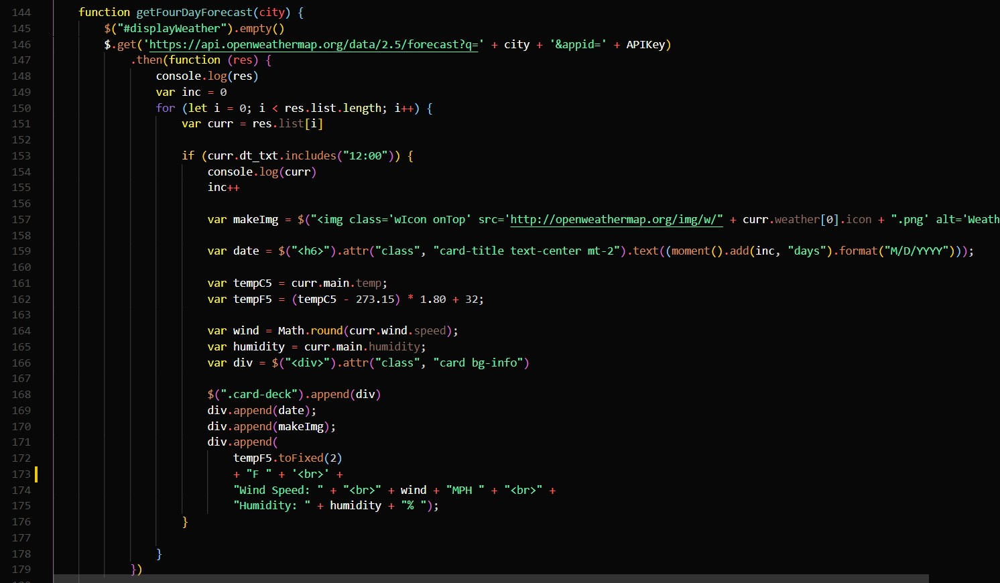

# weather-dashboard

Click here to access the deployed [website](https://solemansay.github.io/weather-dashboard/).


## description

For this project, my goal was to create a fully functioning weather dashboard to search for current weather as well as the weekly forecast using the Open Weather Map API. This weather dashboard is fully dynamic creating the div to show current weather information as well as the card deck to show future weather information 5 days in advance. When you search for a city the search result will be stored in local storage as well as appended as a list item under the search bar that can later be clicked on and once again present the weather data for that city.

## putting it together 

The HTML for this project was very simple as most of the website is being created dynamically. 



The first thing I did on the JS page was to create a few global variables as well as to get the city names that had already been searched and store them into the cityName array to be appended to the search history list. 



Following this, I created the function responsible for fetching the information needed (temp, lat, long, weather description) from the weather API and append it to the page inside of the div I created on the HTML with some CSS and bootstrap styling as needed. 



To get the UV INDEX I needed to enlist the help of a separate link and incorporate the lat and long received from the last link to append the correct UV index on today's weather. I Also created badges to store the information in that change color concerning the different levels of the UV index. 



After this, I made the function to collect the city name typed into the input field and passed that information to both todays forecast function as well as the 5-day forecast. 

Once I had completed that all that was left to do was to create the function for the 5-day forecast. I enlisted the help of a for loop to accomplish this, selecting 5 days in the future only at the times of noon. To append the date and time to the separate cards holding the weather information I had just collected I used moment JS and added one day for every loop made. 



Once this information was appended to the div that I had hardcoded into the HTML using bootstrap's card deck class I was complete. 

```
Thank you for viewing my Weather Dashboard project! I hoped you enjoyed my solution and continue to follow my 
career as a jr full-stack web developer. 
-Soleman Sayeed
```

## Questions
  
If you have any questions anout the repo, open an issue or contact me directly at [solemansay](https://github.com/solemansay/). 
Or send me an email at solemansay@gmail.com


